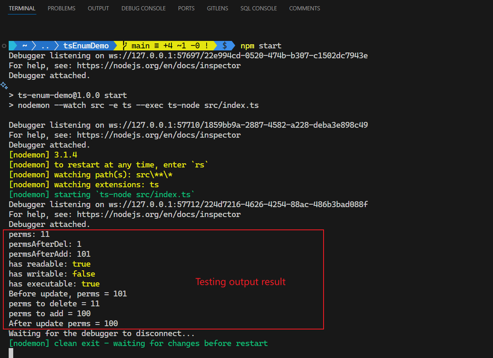

# TypeScript 枚举类型在基于位运算的权限管理中的应用


该项目为 CSDN 博文《【TypeScript 学习】TypeScript 枚举类型发散：基于位运算的权限管理 CRUD 操作》的完整示例。

## 初始准备

- Node.js：`v18.16.0`
- TypeScript：`Version 5.4.3`
- npm：`v9.8.1`


## 运行项目

```bash
# Install dependencies
$ npm i
# Show testing result
$ npm start
Debugger listening on ws://127.0.0.1:56700/25320def-b391-4d02-8473-4fe21a53a2f2
For help, see: https://nodejs.org/en/docs/inspector
Debugger attached.

> ts-enum-demo@1.0.0 start
> nodemon --watch src -e ts --exec ts-node src/index.ts

Debugger listening on ws://127.0.0.1:56703/c4726213-4aee-4676-b47b-65a9052887e0
For help, see: https://nodejs.org/en/docs/inspector
Debugger attached.
[nodemon] 3.1.4
[nodemon] to restart at any time, enter `rs`
[nodemon] watching path(s): src\**\*
[nodemon] watching extensions: ts
[nodemon] starting `ts-node src/index.ts`
Debugger listening on ws://127.0.0.1:56705/83be7c8d-95da-47ce-aa60-090352ad23b2
For help, see: https://nodejs.org/en/docs/inspector
Debugger attached.
perms: 11
permsAfterDel: 1
permsAfterAdd: 101
has readable: true
has writable: false
has executable: true
Before update, perms = 101
perms to delete = 11
perms to add = 100
After update perms = 100
Waiting for the debugger to disconnect...
[nodemon] clean exit - waiting for changes before restart
```

L21 ~ L30 即为测试结果。

实测效果截图：


